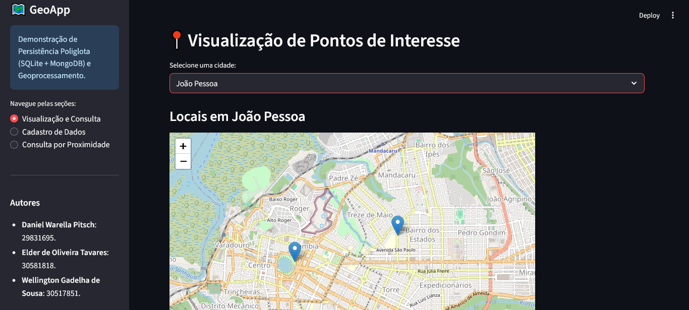
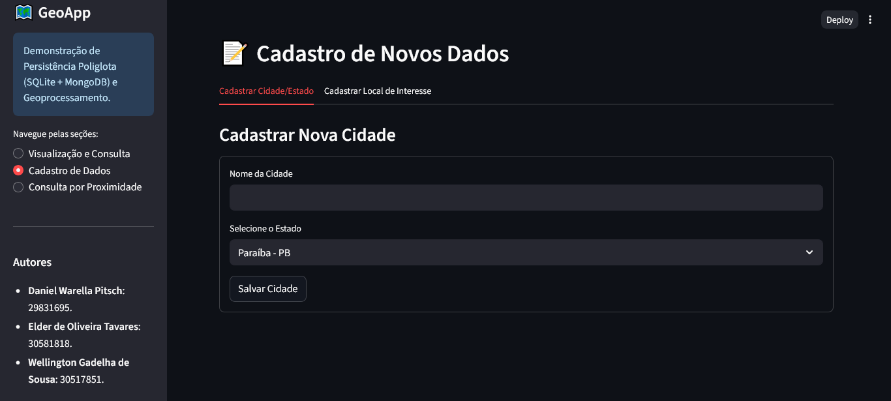
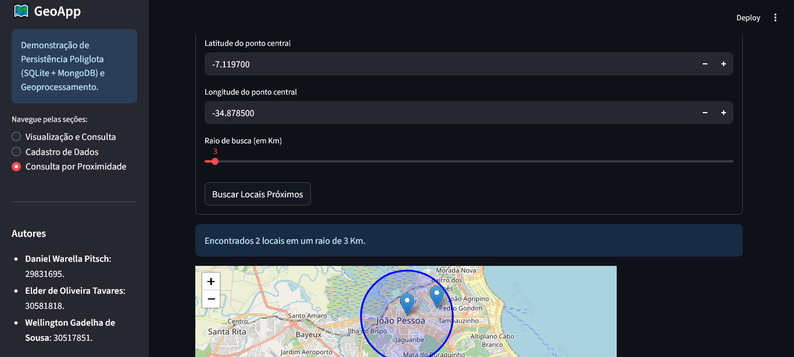

GeoApp: Persistência Poliglota e Geoprocessamento
📖 Sobre o Projeto

O GeoApp é uma aplicação web desenvolvida em Python para demonstrar de forma prática o conceito de Persistência Poliglota, utilizando dois tipos diferentes de bancos de dados — SQLite e MongoDB — para armazenar e consultar dados em contextos distintos.

Além disso, a aplicação implementa recursos de geoprocessamento, como cálculo de distância e busca por proximidade, manipulando dados espaciais (latitude e longitude) e exibindo os resultados em mapas interativos. A interface foi construída com Streamlit, facilitando a interação e a visualização dos dados.
🏛️ Arquitetura Adotada: Persistência Poliglota

A principal característica deste projeto é a arquitetura de persistência poliglota, que consiste em usar diferentes tecnologias de banco de dados para diferentes finalidades dentro da mesma aplicação. A escolha de cada banco foi baseada em suas forças:
1. SQLite (Banco de Dados Relacional)

    O quê armazena? Dados estruturados e tabulares, como países, estados e cidades.

    Por quê? SQLite é um banco de dados SQL leve, embutido na aplicação e ideal para dados que possuem um esquema bem definido e relações claras entre si (uma cidade pertence a um estado, que pertence a um país). Ele garante a integridade e a consistência desses dados relacionais.

2. MongoDB (Banco de Dados NoSQL - Documentos)

    O quê armazena? Dados semiestruturados e geoespaciais, como locais de interesse (pontos turísticos, estabelecimentos, etc.). Cada local é um documento JSON contendo nome, descrição e, mais importante, as coordenadas geográficas.

    Por quê? MongoDB é um banco de dados orientado a documentos, o que oferece grande flexibilidade para armazenar objetos complexos como documentos JSON. 

Integração

A aplicação integra os dois bancos de forma transparente para o utilizador:

    Ao carregar a página de visualização, a lista de cidades é obtida do SQLite.

    Ao selecionar uma cidade, a aplicação usa o nome dessa cidade para consultar o MongoDB e obter todos os locais de interesse associados a ela, exibindo-os no mapa.

✨ Funcionalidades

    ✅ Cadastro de Dados Relacionais: Interface para adicionar novas cidades e associá-las a estados existentes no SQLite.

    ✅ Cadastro de Locais Geoespaciais: Formulário para inserir pontos de interesse (nome, descrição, coordenadas) como documentos no MongoDB.

    ✅ Visualização Integrada: Seleção de uma cidade (do SQLite) para visualizar todos os seus pontos de interesse (do MongoDB) em um mapa interativo.

    ✅ Consulta por Proximidade: Ferramenta que permite ao utilizador definir um ponto geográfico central e um raio em quilómetros para encontrar e visualizar no mapa todos os locais próximos.

    ✅ Interface Interativa: Toda a aplicação é controlada por uma interface simples e reativa construída com Streamlit.

🛠️ Tecnologias Utilizadas

    Linguagem: Python 3.12+

    Interface Web: Streamlit

    Banco Relacional: SQLite3

    Banco NoSQL: MongoDB

    Integração com MongoDB: PyMongo

    Cálculos Geográficos: Geopy

    Visualização de Mapas: Folium e Streamlit-Folium

    Manipulação de Dados: Pandas

🚀 Como Executar o Projeto

Siga os passos abaixo para executar a aplicação no seu ambiente local.
Pré-requisitos

    Python 3.12 ou superior instalado.

    MongoDB Community Server instalado e em execução na porta padrão (27017).

Passos

    Clone este repositório ou faça o download dos arquivos para uma pasta local.

    Navegue até a pasta do projeto pelo seu terminal:

    cd projeto_persistencia_poliglota

    Crie e ative um ambiente virtual (recomendado):

    # Criar o ambiente
    python -m venv venv

    # Ativar no Windows
    .\venv\Scripts\activate

    # Ativar no macOS/Linux
    source venv/bin/activate

    Instale as dependências a partir do arquivo requirements.txt:

    pip install -r requirements.txt

    Execute a aplicação Streamlit:

    streamlit run app.py

Seu navegador será aberto automaticamente com a aplicação em execução. Na primeira vez, os bancos de dados serão criados e populados com dados de exemplo.
📸 Telas da Aplicação
1. Visualização e Consulta

A tela principal permite selecionar uma cidade e ver todos os seus pontos de interesse marcados em um mapa interativo.

2. Cadastro de Dados

Esta seção possui abas para cadastrar novas cidades no SQLite ou novos locais de interesse (com coordenadas) no MongoDB.

3. Consulta por Proximidade

Ferramenta para encontrar locais dentro de um raio especificado a partir de um ponto central. O resultado é exibido em um mapa com um círculo representando a área de busca.

